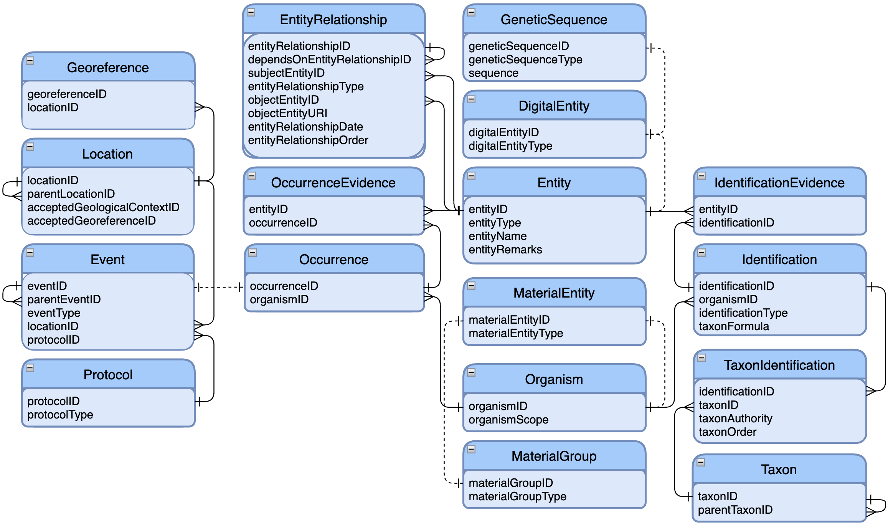

# Data model testing: Material

This repository supports the testing of the GBIF Unified Model ("UM") to better handle material and specimen data as detailed in [the open call](https://www.gbif.org/news/2ZQI4f1AtimpT5gd3qk9pd/call-for-proposals-to-help-mature-and-test-how-specimens-are-handled-in-gbifs-emerging-unified-data-model). This builds on work presented in [webinar 2](https://vimeo.com/728051381) of the data model series, and in particular as demonstrated using  [Arctos](https://arctosdb.org/) as an example shown in [this short video](https://vimeo.com/727320677).

A overview of the structure of the UM is given in the figure below, which omits the [common models](https://docs.google.com/document/d/1ZTMt-V3U0D0761bqqogeN58MjuHhIs_Kisu6CRtl-uA) for readability. The "common models" allow Agents (e.g., people), Assertions (e.g., measurements), Citations, and Identifiers (e.g., other catalog numbers) to be added to any Entity below. The background work for the model is introduced in [this document](https://docs.google.com/document/d/1QpXwole_j32QZAg6ddqOrAB5OOdqVJKdoKKzz06CK-o/edit) and a PostgreSQL [database creation script](./schema.sql) is provided.

Participants in this process shape data from their collections onto the UM and load it into the PostgreSQL database (see [schema](./schema.sql)). A folder for each participant captures the data files, which may be further divided in subfolders per collection or dataset.

Contributions through pull requests are preferred, but assistance will be given to those unfamiliar with GitHub. Contributions from external groups not participating in the open call are also very welcome through pull requests. 

GBIF will integrate all contributions into a single database, on top of which a prototype material catalogue will be deployed providing search and exploration across the integrated data.

A suggested approach for how to prepare data is [given](./data-mapping.md).
