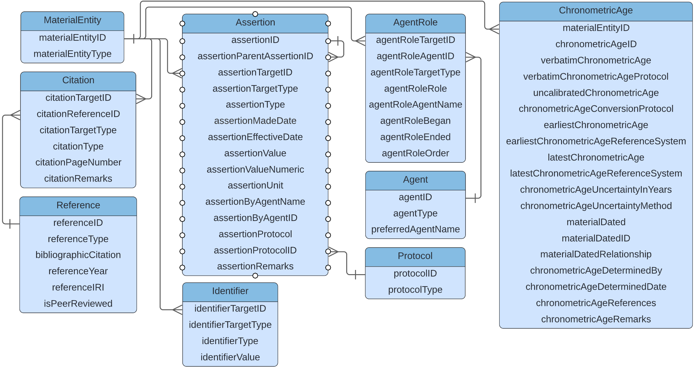

# Data mapping (working draft)

## Introduction

The Unified Model ('UM' hereafter) is highly normalized and it may seem overwhelming at first. That is understandable. Remember that the UM is mean to be a comprehensive representation that accommodates all use cases. It may not seem the simplest way to represent the data you'll be mapping because it is meant to cover other prespectives as well. As such, please also keep in mind that this exercise is to test the capacity of the UM to faithfully represent the data in collection management systems in aggregate, not to determine a least common denominator publishing model, such as is the case with Darwin Core archives. 

## General considerations

As a general rule for his exercise, when creating tables in the UM, use resolvable global unique identifiers for the 'ID' fields if you have them. If you don't, use non-resolvable global unique identifiers if you have them. If you don't, generate UUIDS as identifiers in place of the identifiers that are unique only within the scope of your database. In cases where your database does not have identifiers for records that can be inferred for the UM, generate UUIDs for these identifiers.

In this document there will be illustrative figures for parts of the UM and how they fit together. These figures take the form of Entity-Relationship (ER) diagrams whose primary purpose is to illustrate the structure of the UM. These diagrams do not necessarily show the full set of fields for the tables they represent, nor does it show data types and other constraints. The definitive version of the tables to populate is in the database creation script ([schema.sql](./schema.sql)).

Most of the tables in the UM have fields that benefit from using controlled vocabularies. Some of these fields require that values strictly adhere to a controlled vocabulary. In the database creation script these can be found as 'ENUMS'. Following is a simple example:

```
CREATE TYPE ENTITY_TYPE AS ENUM (
  'DIGITAL_ENTITY',
  'MATERIAL_ENTITY'
);
```
This is the controlled vocabulary for the `entity_type` field (no other values ar valid), as can be seen in the statement that creates the `entity` table:

```
CREATE TABLE entity (
  entity_id TEXT PRIMARY KEY,
  entity_type ENTITY_TYPE NOT NULL,
  dataset_id TEXT NOT NULL,
  entity_name TEXT,
  entity_remarks TEXT
);
```

Not every 'type' field in the UM is controlled by an ENUM. For some 'type' fields, and any other fields for which a controlled vocabulary is suggested, any requirements will be given in the [Suggested steps](#suggested-steps). Other than the requirements given, feel free to use values that make sense for your data. However, please do follow the [recommendations for `assertionUnits`](https://docs.google.com/document/d/1ZTMt-V3U0D0761bqqogeN58MjuHhIs_Kisu6CRtl-uA/edit#heading=h.a8fhzgvypuhh)

 Principles of controlled vocabularies. Part of what this exercise will reveal is the diversity of data that are being managed in collection management systems. The aggregation of vocabulary values used will be a very interesting outcome.

Throughout the UM there are four concepts (`AgentRole`, `Assertion`, `Citation`, and `Identifier`) that are repeated, except that they are attached to distinct classes in the model (e.g., `EventAgentRole`, `GeneticSequenceAssertion`, `MaterialEntityCitation`, `AgentIdentifier`). 
The UM provides four special tables (`AgentRole`, `Assertion`, `Citation`, and `Identifier`) to supplement the core information of other tables (e.g., `Organism AgentRole`, `Event Assertion`, `GeneticSequence Citation`, `Agent Identifier`). The document [GBIF Common Models](https://docs.google.com/document/d/1ZTMt-V3U0D0761bqqogeN58MjuHhIs_Kisu6CRtl-uA/edit?usp=sharing) describes how these concepts fit into the UM.

Each of the common model tables can be linked to the set of tables given in the COMMON_TARGETS enumeration, which is defined as follows in the database creation script [schema.sql](./schema.sql):
```
CREATE TYPE COMMON_TARGETS AS ENUM (
  'ENTITY',
  'MATERIAL_ENTITY',
  'MATERIAL_GROUP',
  'ORGANISM',
  'DIGITAL_ENTITY',
  'GENETIC_SEQUENCE',
  'EVENT',
  'OCCURRENCE',
  'LOCATION',
  'GEOREFERENCE',
  'GEOLOGICAL_CONTEXT',
  'PROTOCOL',
  'AGENT',
  'COLLECTION',
  'ENTITY_RELATIONSHIP',
  'IDENTIFICATION',
  'TAXON',
  'REFERENCE',
  'AGENT_GROUP',
  'ASSERTION',
  'CHRONOMETRIC_AGE'
);
```
## Suggested steps

Following is an outline of the steps we suggest to following the exercise to map your collection management system data to the UM. Each step has a link to a more detailed description of what to do. The order of these steps was designed to make sure that you already have records for concepts that will be linked to in subsequent steps of the mapping process.

[1. Map Agents](#1-map-agents)

[2. Map References](#2-map-references)

[3. Map Assertions, Citations, and Identifiers for Agents](#3-map-assertions-citations-and-identifiers-for-agents)

[4. Map Protocols](#4-map-protocols)

[5. Map MaterialEntities](#5-map-materialentities)

[6. Map Agent Roles, Assertions, Citations, Identifiers and ChronometricAges for MaterialEntities and their subtypes](#6-map-agent-roles-assertions-citations-identifiers-and-chronometricages-for-materialentities-and-their-subtypes))

[7. Map DigitalEntities](#7-map-digitalentities)

[8. Map AgentRoles, Assertions, Citations, and Identifiers for DigitalEntities](#8-map-agentroles-assertions-citations-and-identifiers-for-digitalentities)

[9. Map EntityRelationships between Entities](#9-map-entityrelationships-between-entities)

[10. Map Locations, Georeferences, and GeologicalContexts]([#10-map-locations-georeferences-and-geologicalcontexts))

[11. Map AgentRoles, Assertions, Citations, and Identifiers for Locations, Georeferences, and GeologicalContexts](#11-map-agentroles-assertions-citations-and-identifiers-for-locations-georeferences-and-geologicalcontexts)

[12. Map Occurrences and other Events](#12-map-occurrences-and-other-events)

[13. Map AgentRoles, Assertions, Citations, and Identifiers for Occurrences and other Events](#13-map-agentroles-assertions-citations-and-identifiers-for-occurrences-and-other-events)

[14. Map Taxa](#14-map-taxa)

[15. Map AgentRoles, Assertions, Citations, and Identifiers for Taxa](#)

[16. Map Identifications](#)

[17. Map AgentRoles, Assertions, Citations, and Identifiers for Identifications](#)

## 1. Map Agents

NOTE: Skip if your agents are identified only by name.

It is recommended to map `Agent` first (see [Figure 1](#figure-1)), because their identifiers will be used in the construction of many of the other tables in the UM. If you track agents (e.g., people, groups of people, organizations, collections) with identifiers other than just their names in your database, use them to create the agent tables in the UM, including `AgentRelationship`, if you have those. If you don't track agents separately in your database, don't worry about it, they can be designated by their names where appropriate in the UM. 

<p align=center>
<p align=center>Figure 1. Agents and their relationships in the Unified Model

### `agent_type` vocabulary
If an `Agent ` is a `Collection` or an `AgentGroup`, the `agent_type` MUST be `COLLECTION` or `AGENT_GROUP` respectively. However, the agent_type field is not controlled by an ENUM, because there are other possible values that are not subtypes of `Agent`, such as `ORGANIZATION`, `PERSON`, and even `ORGANISM`.

### `collection_type` vocabulary
We would expect to be informed here by work on the Latimer Core. For this exercise we suggest, for example, `MUSEUM`, `HERBARIUM`, `BOTANICAL_GARDEN`, `ZOO`.

### `agent_group_type` vocabulary
An `AgentGroup` is a way to refer to a single `Agent` entity that is composed of multiple `Agent`s. Thus, a group of `Collection`s might be a `CONSORTIUM`, a group of university students might be a `CLASS`.
  
### `agent_relationship_type` vocabulary
The range of possible relationships between `Agent`s is vast. Note that the relationship has directionality. The `subject_agent_id` is related to the `object_agent_id` in the direction expressed in the `agent_relationship_type`. Even so, it helps to express the directionality in the `agent_relationship_type` term, for example, `DOCTORAL_ADVISOR_OF` instead of `DOCTORAL_ADVISOR`.

## 2. Map References

NOTE: Skip if your `Reference`s are identified only by bibliographic citations or if you do not have `Reference`s in your data.

A `Reference`, like an `Agent`, has the potential to be related to many different kinds of things (e.g., `MaterialEntity`, `Event`, `Taxon`) in the UM, through `Citation`s. So, if you track references with identifiers, create `Reference` records for them so that they can be connected when the other tables they are related to are created. If you don't track reference separately in your database, don't worry about it, they can be designated by their bibliographic citations where appropriate in the UM. 

### `reference_type` vocabulary
Here are some suggestions, but feel free to suggest others if none of these suffices: `JOURNAL_ARTICLE`, `BOOK`, `BOOK_SECTION`, `DISSERTATION`,  `FIELD_NOTEBOOK`, `WEB_PAGE`, `OTHER`.

## 3. Map Assertions, Citations, and Identifiers for Agents

NOTE: Skip if you created no `Agent` records in [Step 1](#1-map-agents)

It is possible to create Agent `Assertion`s, `Citation`s, and `Identifier`s. See [GBIF Common Models](https://docs.google.com/document/d/1ZTMt-V3U0D0761bqqogeN58MjuHhIs_Kisu6CRtl-uA/edit?usp=sharing) for general discussions about how to map to these three types of tables and considerations when developing the vocabularies for `assertion_type` and `assertion_unit`.

### `assertion_target_type` vocabulary
The value for this term MUST be one of `AGENT`, `AGENT_GROUP`, or `COLLECTION` and MUST match the table to which the Assertion applies.

## 4. Map Protocols

NOTE: Skip if your `Protocol`s are identified only by simple strings (names or descriptions) or if you do not have `Protocol`s mentioned in your data.

A `Protocol` can be used by the classes `Event`, `ChronometricAge`, and the various `Assertion`s. If you track protocols with identifiers, create `Protocol` records for them so that they can be connected when the tables they are related to are created.

## 5. Map MaterialEntities

<p align=center>
<p align=center>Figure 2. Entities and their relationships in the Unified Model

A `MaterialEntity` can be any physical object (same as [bco:material entity](http://purl.obolibrary.org/obo/BFO_0000040) and [dcterms:PhysicalResource](http://purl.org/dc/terms/PhysicalResource)). In the UM there can be many types of `MaterialEntity`s, which are distinguished by the value of `materialEntityType`. These can be as specific as desired, but there are two `MaterialEntity` subtype classes to distinguish two important concepts, `MaterialGroup` and `Organism`. For each `MaterialEntity`, also create an `Entity` record using the same identifier for the `entityID` as for the `digitalEntityID`. The `entityType` for the `Entity` MUST be `MATERIAL_ENTITY`. 
  
A `MaterialGroup` is any set of `MaterialEntity`s and its utility is to be able to make `Assertion`s about the group as a whole, distinct from `Assertion`s about its individual members (e.g., the weight of an entire catch as opposed to the weights of selected individuals in the catch). A `MaterialGroup` record MUST have a corresponding `MaterialEntity` record, which in turn MUST have `MATERIAL_GROUP` as its `materialEntityType`.

An Organism (same as [dwc:Organism](https://dwc.tdwg.org/terms/#organism)) is modeled in the UM as a `MaterialEntity`, even if none of the material remains accessible (such as in the case of some observations, or the case of a specimen that was lost or destroyed). In the most basic case, a cataloged item consists of the entire existing material remains of a single `Organism`. These may be separated into "parts", which may or may not be tracked separately. When they are tracked separately, the `Entity` that unites them is the `Organism`. The derivation of the "parts" from the `Organism` (or from each other) are [expressed through `EntityRelatiosnhip`s](#7-map-entityrelationships-between-materialentities). An `Organism` record MUST have a corresponding `MaterialEntity` record, which in turn MUST have `ORGANISM` as its `materialEntityType`.

## 6. Map Agent Roles, Assertions, Citations, Identifiers and ChronometricAges for MaterialEntities and their subtypes

Figure 3 shows the relationships between `MaterialEntity` and associated tables, including the common model tables. The relationships between `MaterialEntity` and other `Entity ` tables was shown in Figure 2. Each of the `Entity` tables can be connected to the common model tables. The important thing is to make sure that the connections happen at the appropriate, most specific level in the hierarchy. For example, suppose a blood sample was taken from an `Organism` and its volume was measured. The blood sample is a `MaterialEntity` (NOT and `Organism`). There should be an `EntityRelationship` showing the subject `MaterialEntity` had the relationship `extractedFrom` the object `Organism`. The blood sample volume should result in an `Assertion` for the `MaterialEntity`, not an `Assertion` for the corresponding parent `Entity` record, nor the related `Organism` record. Specifically, the `assertionTargetID` should be the same as the `materialEntityID` for the blood sample, the `assertionTargetType` MUST be `MATERIAL_ENTITY`, the `assertionType` should be `VOLUME`, the `assertionValue` should be left empty, the `assertionValueNumeric` should have the numerical value of the volume, and the `assertionUnit` should have an appropriate SI unit (e.g., 'ml'). The same principles apply to relationships to the `Citation`, `AgentRole` and `Identifier` tables - they should be associated with the correct `Entity`.
 
A `ChronometricAge`s MUST only be related directly to a `MaterialEntity`. 

<p align=center>
<p align=center>Figure 3. MaterialEntities and related tables in the Unified Model
  
## 7. Map DigitalEntities

In the UM there can be many types of `DigitalEntity`. These are distinguished by the `digitalEntityType` field, which has a strictly controlled vocabulary consisting of the values in the following enumeration:

```
CREATE TYPE DIGITAL_ENTITY_TYPE AS ENUM (
  'DATASET',
  'INTERACTIVE_RESOURCE',
  'MOVING_IMAGE',
  'SERVICE',
  'SOFTWARE',
  'SOUND',
  'STILL_IMAGE',
  'TEXT',
  'GENETIC_SEQUENCE'
);
```
  
One of these, the `GENETIC_SEQUENCE` is a formal subtype of `DigitalEntity` (see Figure 2). This means that when a `GENETIC_SEQUENCE` record is created, a corresponding `MaterialEntity` record MUST also be created, and the `digitalEntityType` for it MUST be `GENETIC_SEQUENCE`. For each `DigitalEntity`, also create an `Entity` record using the same unique identifier for the `entityID` as for the `digitalEntityID`. The `entityType` for the `Entity` MUST be `DIGITAL_ENTITY`.

## 8. Map AgentRoles, Assertions, Citations, and Identifiers for DigitalEntities

The same kinds of common model associations shown in Figure 3 for `MaterialEntity`s can be made for `DigitalEntity`s, except that each `targetID` MUST be the same as the identifier (`digitalEntityID` or `geneticSequenceID`) for the `DigitalEntity` or `GeneticSequence` it is directly associated with. The values for the `targetType` fields MUST be `DIGITAL_ENTITY` or `GENETIC_SEQUENCE`, depending on the table they are to be directly related to.

## 9. Map EntityRelationships between Entities

At this stage in the process, all of the `Entity` records will have been created, providing the prerequisite for being able to create the relationships between them. The supertype/subtype relationships between `Entity` tables were shown above in Figure 2, and should already heve been created at this point. Here we will concentrate on other associations, ones that can be captured in the `EntityRelationship` table. The `EntityRelationship` table is a powerful way to make just about any connection between Entities in the UM. Any Entity can be related to any other one with any relationship. There are two things to keep in mind here. The first is that the subtype relationships should be strictly relegated to the correspondence of the values of identifier fields (e.g., `entityID` and `materialEntityID` for a `MaterialEntity`). This would be the equivalent of an `EntityRelationship` stating that a particular `Entity` `isA` `MaterialEntity`, which would be superfluous. The second thing to keep in mind is that the semantics of the relationships is entirely dependent on the clear understanding of the predicate (the `entityRelationshipType`) and the correct assignment of `Entities` to the subject and object roles. The relationships should always be read as 'subject predicate object' - that is, the relationship has a direction. Each relationship can have a complementary one where the subject/object roles are reversed and the predicate shows what the relationship looks like from the opposite direction. For example, if `Organism` 'A' was `eaten by` another `Organism` 'B', it follows that `Organism` 'B' `ate` `Organism` 'A'. It is not clear at the time of developing this documentation whether reverse roles are necessary. We leave that decision to your discretion when populating `EntityRelationship`s.


## 10. Map Locations, Georeferences, and GeologicalContexts

`Location`s in the UM are used to provide both textual and geospatial context. In particular, they are used to describe where `Event`s happened. Figure 4 shows the structural relationships between the Location-related tables in the UM. 
  
Georeferences are special assertions of the geospatial interpretation of a `Location`s. As assertions, the model supports zero, one, or multiple interpretations per `Location`, whether current, historical, accepted, or disputed. The UM also supports the designation of zero or one accepted georeferences by populating `accepted_georeference_id` in the `Location` table with the `georeference_id` of the corresponding `Georeference`, if any. 
  
`GeologicalContext`s is modeled similarly to a `Georeference`, but with an ``accepted_geological_context_id` in the `Location` table that MUST match the `geological_context_id` of the corresponding `GeologicalContext`, if any. 
  
<p align=center>
<p align=center>Figure 4. Locations, Georeferences and GeologicalContexts in the Unified Model

## 11. Map AgentRoles, Assertions, Citations, and Identifiers for Locations, Georeferences, and GeologicalContexts

The 'common model' tables associated with the three Location-related tables can be populated at this point. The values for the `targetType` fields of the commn model tables MUST be `LOCATION`, `GEOREFERENCE` or `GEOLOGICAL_CONTEXT`, depending on the table they are to be directly related to.


## 12. Map Occurrences and other Events

An `Event` is something that happens within a place during a period of time. The spatial scale and temporal duration may be as specific or vague as necessary, and may or may not be provided. `Event`s are hierarchical in the UM, with a parent `Event` containing all of its child `Event`s both spatially and temporally. A project (or any other higher organizational initiative) might be a parent-most `Event`, the spatial and temporal limits of which encompass all of the `Event`s within it. The next level down might consist of collecting expeditions launched as part of the parent project, for example. Each `Event` can likewise encompass sub-`Event`s to an arbitrary hierarchical depth, each with the same or distinct `Location` and temporal bounds as its parent (under the limitation of being contained).

<p align=center>
<p align=center>Figure 5. Events in the Unified Model

In the UM, an `Occurrence` is a subtype of `Event` in which the activity (observing, collecting, sampling) established the existence of an `Organism` within a spatiotemporal context, usually with accompanying evidence. The `OccurrenceEvidence` table serves to connect the `Occurrence` with digital and/or material evidence, such as images, material samples or whole organisms, and genetic sequences. In collections, an `Organism` is often effectively the `Entity` that gets cataloged, with an accompanying list of 'preparations' that represent the parts of the `Organism` that are or were present in the collection. If you do not track 'parts' separtely with their own characteristics, the `Organism` record would be the one used for the `OccurrenceEvidence`. Note that the `organismID` is not an `occurrenceID` - the former is an identifer for an `Organism` (a `MaterialEntity`), while the latter is an identifier for the `Occurrence` (an `Event`), and `MaterialEntity`s are not `Event`s. In the absence of unique (and distinct) identifers for `Organism`s and `Occurrence`s, they will have to be generated to populate the UM correctly, as described in the [General considerations](#general-considerations) section.

The `Occurrence` carries with it the ephemeral characteristics of the Organism at the place and time of the `Event`. Thus, for example, an `Organism` that had blood samples taken over its lifetime may have had a `reproductiveCondition` of `juvenile` in an early `Occurrence` and a `reproductiveCondition` of `adult` in later one. 
  
Each `Occurrence` has its own `occurrenceID`. The `Occurrence`s associated with a given `Organism` can be discovered by the `organismID` they have in common. Every `Occurrence` must have a corresponding `Event` record in which the `eventID` is the same is the `occurrenceID` and the `eventType` for the `Event` record MUST be `OCCURRENCE`.
  

<p align=center>Figure 6. Occurrences and their evidence in the Unified Model

## 13. Map AgentRoles, Assertions, Citations, and Identifiers for Occurrences and other Events

## 14. Map Taxa

## 15. Map AgentRoles, Assertions, Citations, and Identifiers for Taxa

## 16. Map Identifications


<p align=center>Figure 7. Identifications in the Unified Model

## 17. Map AgentRoles, Assertions, Citations, and Identifiers for Identifications


## Data Mapping (previous draft)
The data model is highly normalized and it's understandable that it may feel overwhelming at first.
A suggested approach on how to map data to the model is provided, aiming to introduce it in sections.
These are structured as:

1. Create the core `Entities` in the model (i.e. Specimens, Images, Organisms)
2. Create the `EntityRelationships` between those `Entities` (e.g. capturing that a tissue sample was taken from a specimen)
3. Create the `Events` associated with the `Entities` (e.g. the gathering event)
4. Add the current and historical species `Identifications` to the `MaterialEntities` (Morphological or DNA based)
5. Connect the `Agents` (e.g. People) associated with the `Entities` and `Events`
6. Add the `Assertions` such as measurements or additional fields of interest for all `Entities`
7. Add the `Identifiers` to be tracked along with the `Entities`

It is likely that the source data being mapped won't have all data objects needed and some will need to be "invented". 
For example, a source database may have the collecting event and location merged into a single table. 
This will require an object to be split, or possibly inferred during the mapping.

- All primary keys in tables shown be globally unique, to allow the data to be mixed with data from other sources
- We recommend using a UUID as a key for any object inferred (for this exercise)
- Please always refer to the latest [data schema](./schema.sql) when mapping; it may have evolved since this documentation was created

## 1. Create the core `Entities`

The tables to populate are shown:


Notes:

- This uses inheritance, and so an `Entity` record must exist with the *same ID* as the entry for the sub-entity (and so on)
- The `Entity` IDs should be globally unique as the records will be integrated with other sources
- The `datasetKey` should be a globally unique identifier. In the absence of one, we recommended to use a UUID

## 2. Create the `EntityRelationships`

The tables to populate are shown:


Notes:

- The `EntityRelationshipID`  should be globally unique as the records will be integrated with other sources

## 3. Create the `Events` 

The tables to populate are shown:


Notes:

- The IDs should be globally unique as the records will be integrated with other sources

## 4. Add the species `Identifications` 

The tables to populate are shown for morphological identification:


Notes:

- The IDs should be globally unique as the records will be integrated with other sources

For DNA based identification of a sequence, using a reference taxonomic database the tables are shown:


## 5. Connect the `Agents` 

The tables to populate are shown:


## 6. Add the `Assertions` 

The tables to populate are shown:


## 7. Add the `Identifiers`

The tables to populate are shown:


