# Data mapping (working draft)

## Introduction

The Unified Model ('UM' hereafter) is highly normalized and it may seem overwhelming at first. That is understandable. Remember that the UM is mean to be a comprehensive representation that accommodates all use cases. It may not seem the simplest way to represent the data you'll be mapping because it is meant to cover other prespectives as well. As such, please also keep in mind that this exercise is to test the capacity of the UM to faithfully represent the data in collection management systems in aggregate, not to determine a least common denominator publishing model, such as is the case with Darwin Core archives. 

## Suggested steps

Below is a suggested stepwise approach to map your data to the tables in the UM. As a general rule for his exercise, when creating tables in the UM, use resolvable global unique identifiers for the 'ID' fields if you have them. If you don't, use non-resolvable global unique identifiers if you have them. If you don't, generate UUIDS as identifiers in place of the identifiers that are unique only within the scope of your database. In cases where your database does not have identifiers for records that can be inferred for the UM, generate UUIDs for these identifiers.

In this document there will be illustrative figures for parts of the UM and how they fit together. These figures take the form of Entity-Relationship (ER) diagrams whose primary purpose is to illustrate the structure of the UM. These diagrams do not necessarily show the full set of fields for the tables they represent, nor does it show data types and other constraints. The definitive version of the tables to populate is in the database creation script ([schema.sql](./schema.sql)).

Most of the tables in the UM have fields that benefit from using controlled vocabularies. Some of these fields require that values strictly adhere to a controlled vocabulary. In the database creation script these can be found as 'ENUMS'. Following is a simple example:

```
CREATE TYPE ENTITY_TYPE AS ENUM (
  'DIGITAL_ENTITY',
  'MATERIAL_ENTITY'
);
```
This is the controlled vocabulary for the `entity_type` field (no other values ar valid), as can be seen in the statement that creates the `entity` table:

```
CREATE TABLE entity (
  entity_id TEXT PRIMARY KEY,
  entity_type ENTITY_TYPE NOT NULL,
  dataset_id TEXT NOT NULL,
  entity_name TEXT,
  entity_remarks TEXT
);
```

Not every 'type' field in the UM is controlled by an ENUM. For some of these, suggestions will be given, but will not be limiting. You should feel free to use values for these that make sense for your data. Part of what this exercise will reveal is the diversity of data that are being managed in collection management systems. The vocabularies used will be a very interesting outcome.

Throughout the UM there are four concepts (`AgentRole`, `Assertion`, `Citation`, and `Identifier`) that are repeated, except that they are attached to distinct classes in the model (e.g., `EventAgentRole`, `GeneticSequenceAssertion`, `MaterialEntityCitation`, `AgentIdentifier`). Explanations of how these "common model" tables work are given in [Appendix I](#appendix-i).

##
[1. Map Agents](#1-map-agents)

[2. Map References](#2-map-references)

[3. Map AgentAssertions, AgentCitations, and AgentIdentifiers](#3-map-agentassertions-agentcitations-and-agentidentifiers)

[4. Map Protocols](#4-map-protocols)

[5. Map MaterialEntities](#5-map-materialentities)

[6. Map AgentRoles, Assertions, Citations, ChronometricAges, and Identifiers for MaterialEntities and their subtypes](#)

[7. Map EntityRelationships between MaterialEntities](#)

[8. Map DigitalEntities](#)

[9. Map AgentRoles, Assertions, Citations, and Identifiers for DigitalEntities and their subtypes](#)

[10. Map EntityRelationships between DigitalEntities and between MaterialEntities and Digital Entities](#)

[11. Map Locations, Georeferences, and GeologicalContexts](#)

[12. Map AgentRoles, Assertions, Citations, and Identifiers for Locations, Georeferences, and GeologicalContexts](#)

[13. Map Occurrences and other Events](#)

[14. Map AgentRoles, Assertions, Citations, and Identifiers for Occurrences and other Events](#)

[15. Map OccurrenceEvidence](#)

[16. Map Taxa](#)

[17. Map AgentRoles, Assertions, Citations, and Identifiers for Taxa](#)

[18. Map Identifications](#)

[19. Map AgentRoles, Assertions, Citations, and Identifiers for Identifications](#)

[20. Map IdentificationEvidence](#)

[Appendix I](#appendix-i)

## 1. Map Agents

NOTE: Skip if your agents are identified only by name.

It is recommended to map `Agent` first (see [Figure 1](#figure-1)), because their identifiers will be used in the construction of many of the other tables in the UM. If you track agents (e.g., people, groups of people, organizations, collections) with identifiers other than just their names in your database, use them to create the agent tables in the UM, including `AgentRelationship`, if you have those. If you don't track agents separately in your database, don't worry about it, they can be designated by their names where appropriate in the UM. 

<p align=center>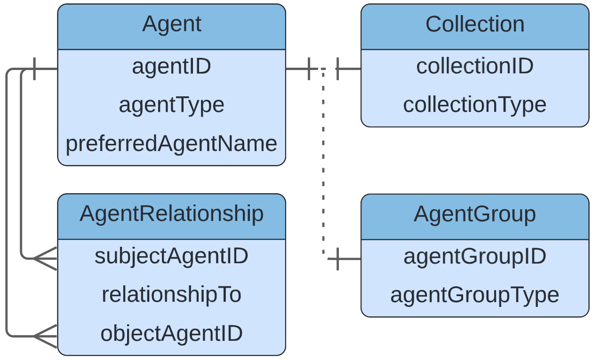
<p align=center>Figure 1. Agents in the Unified Model

## 2. Map References

NOTE: Skip if your `Reference`'s are identified only by bibliographic citations or if you do not have `Reference`'s in your data.

A `Reference`, like an `Agent`, has the potential to be related to many different kinds of things (e.g., `MaterialEntity`, `Event`, `Taxon`) in the UM, through `Citation`'s. So, if you track references with identifiers, create `Reference` records for them so that they can be connected when the other tables they are related to are created. If you don't track reference separately in your database, don't worry about it, they can be designated by their bibliographic citations where appropriate in the UM. 

## 3. Map AgentAssertions, AgentCitations, and AgentIdentifiers

NOTE: Skip if you created no `Agent` records in [Step 1](#1-map-agents)

We wouldn't expect any of these to be common, but it is possible to create `AgentAssertion`'s, `AgentCitation`'s, and `AgentIdentifier`'s. See [Appendix I](#appendix-i) for general discussions about how to tables work.

## 4. Map Protocols

NOTE: Skip if your `Protocol`'s are identified only by simple strings (names or descriptions) or if you do not have `Protocol`'s mentioned in your data.

A `Protocol` can be used by the classes `Event`, `ChronometricAge`, and the various `Assertion`'s. If you track protocols with identifiers, create `Protocol` records for them so that they can be connected when the tables they are related to are created.

## 5. Map MaterialEntities

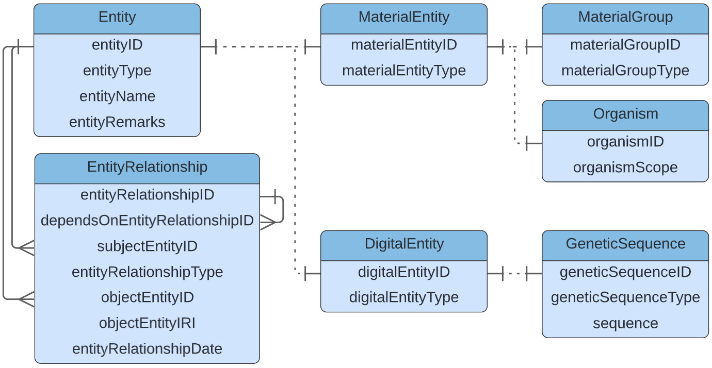
<p align=center>Figure 2. Entities in the Unified Model

A `MaterialEntity` can be any physical object (same as [dcterms:PhysicalResource](http://purl.org/dc/terms/PhysicalResource)). In the UM there can be many types of `MaterialEntity`s (distinguished by `materialEntityType`. These can be as specific as desired, but there are two `MaterialEntity` subtype classes to distinguish two important concepts, a `MaterialGroup` and an `Organism`. 
  
A `MaterialGroup` is any set of `MaterialEntity`'s and its utility is to be able to make `Assertion`s about the group as a whole distinct from `Assertion`s about its individual members (e.g., the weight of an entire catch).

An Organism (same as [dwc:Organism](https://dwc.tdwg.org/terms/#organism)) is modeled in the UM as a `MaterialEntity`, even if none of the material remains accessible (such as in the case of some observations, or a specimens that were lost or destroyed). In the most basic case, a cataloged item consists of the entire existing material remains of a single organism. These may be separated into "parts", which may or may not be tracked separately. When they are tracked separately, the `Entity` that unites them is the `Organism`. The derivation of the "parts" from the Organism (or from each other) are [expressed through `EntityRelatiosnhip`s](#7-map-entityrelationships-between-materialentities).
  
Map all physical objects that are tracked separately in your database to `MaterialEntity`s in the UM. For each `MaterialEntity`, create an `Entity` record as well using the same unique identifier for the `materialEntityID` and the `entityID`.  If the `MaterialEntity` one of the subtypes of `MaterialEntity` (`MaterialGroup` or `Organism`), use the same identifier for these as for the corresponding `MaterialEntity` and `Entity`. 
  
## 6. Map AgentRoles, Assertions, Citations, ChronometricAges, and Identifiers for MaterialEntities and their subtypes

  
## 7. Map EntityRelationships between MaterialEntities
## 8. Map DigitalEntities
## 9. Map AgentRoles, Assertions, Citations, and Identifiers for DigitalEntities and their subtypes
## 10. Map EntityRelationships between DigitalEntities and between MaterialEntities and Digital Entities
## 11. Map Locations, Georeferences, and GeologicalContexts

<p align=center>
<p align=center>Figure 3. Locations in the Unified Model

## 12. Map AgentRoles, Assertions, Citations, and Identifiers for Locations, Georeferences, and GeologicalContexts
## 13. Map Occurrences and other Events

<p align=center>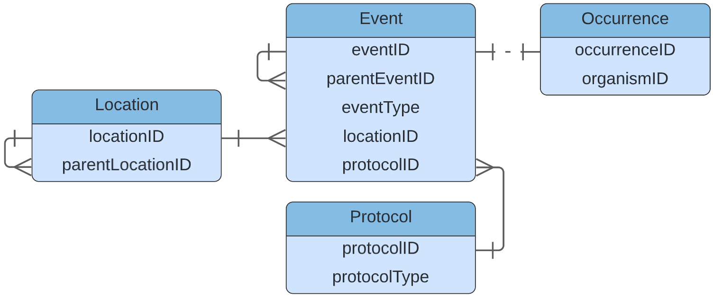
<p align=center>Figure 4. Events in the Unified Model

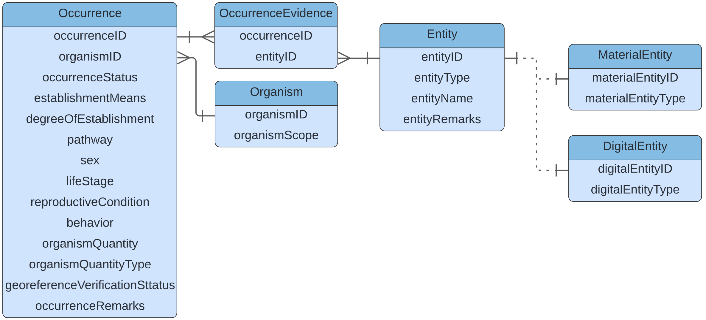
<p align=center>Figure 5. Occurrences in the Unified Model

## 14. Map AgentRoles, Assertions, Citations, and Identifiers for Occurrences and other Events
## 15. Map OccurrenceEvidence
## 16. Map Taxa
## 17. Map AgentRoles, Assertions, Citations, and Identifiers for Taxa
## 18. Map Identifications

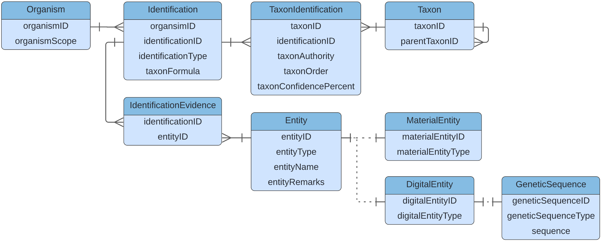
<p align=center>Figure 6. Identifications in the Unified Model

## 19. Map AgentRoles, Assertions, Citations, and Identifiers for Identifications
## 20. Map IdentificationEvidence

## Appendix I


## Data Mapping (previous draft)
The data model is highly normalized and it's understandable that it may feel overwhelming at first.
A suggested approach on how to map data to the model is provided, aiming to introduce it in sections.
These are structured as:

1. Create the core `Entities` in the model (i.e. Specimens, Images, Organisms)
2. Create the `EntityRelationships` between those `Entities` (e.g. capturing that a tissue sample was taken from a specimen)
3. Create the `Events` associated with the `Entities` (e.g. the gathering event)
4. Add the current and historical species `Identifications` to the `MaterialEntities` (Morphological or DNA based)
5. Connect the `Agents` (e.g. People) associated with the `Entities` and `Events`
6. Add the `Assertions` such as measurements or additional fields of interest for all `Entities`
7. Add the `Identifiers` to be tracked along with the `Entities`

It is likely that the source data being mapped won't have all data objects needed and some will need to be "invented". 
For example, a source database may have the collecting event and location merged into a single table. 
This will require an object to be split, or possibly inferred during the mapping.

- All primary keys in tables shown be globally unique, to allow the data to be mixed with data from other sources
- We recommend using a UUID as a key for any object inferred (for this exercise)
- Please always refer to the latest [data schema](./schema.sql) when mapping; it may have evolved since this documentation was created

## 1. Create the core `Entities`

The tables to populate are shown:


Notes:

- This uses inheritance, and so an `Entity` record must exist with the *same ID* as the entry for the sub-entity (and so on)
- The `Entity` IDs should be globally unique as the records will be integrated with other sources
- The `datasetKey` should be a globally unique identifier. In the absence of one, we recommended to use a UUID

## 2. Create the `EntityRelationships`

The tables to populate are shown:


Notes:

- The `EntityRelationshipID`  should be globally unique as the records will be integrated with other sources

## 3. Create the `Events` 

The tables to populate are shown:

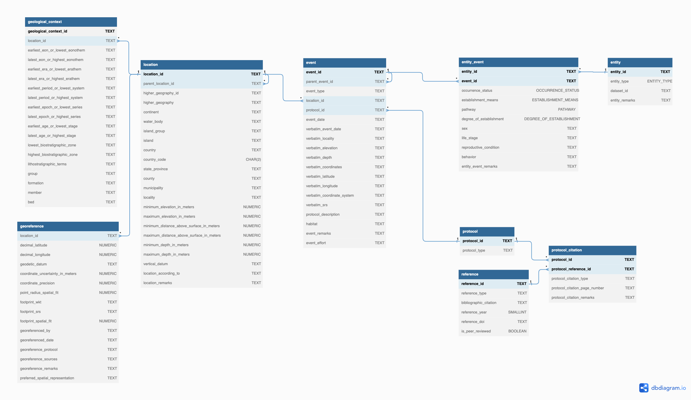

Notes:

- The IDs should be globally unique as the records will be integrated with other sources

## 4. Add the species `Identifications` 

The tables to populate are shown for morphological identification:

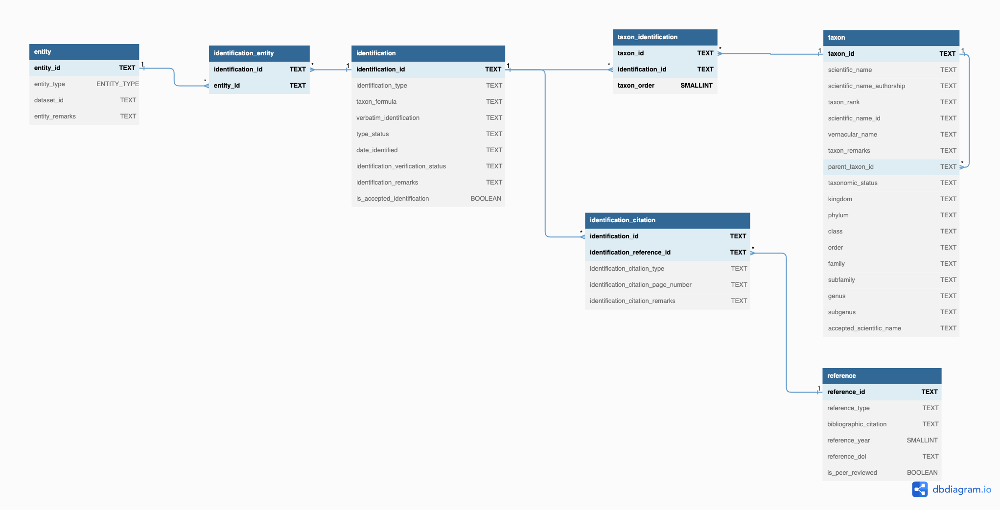

Notes:

- The IDs should be globally unique as the records will be integrated with other sources

For DNA based identification of a sequence, using a reference taxonomic database the tables are shown:

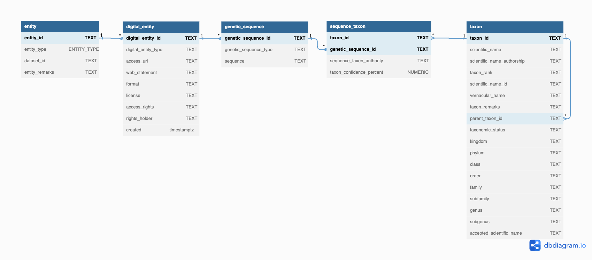

## 5. Connect the `Agents` 

The tables to populate are shown:

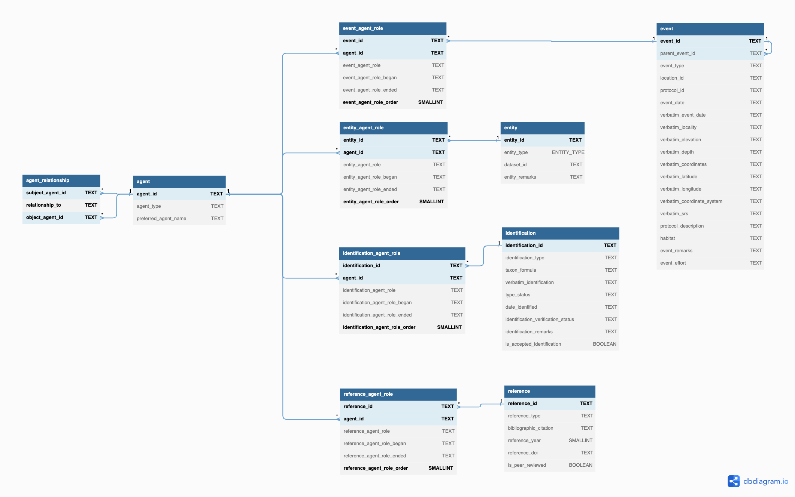

## 6. Add the `Assertions` 

The tables to populate are shown:

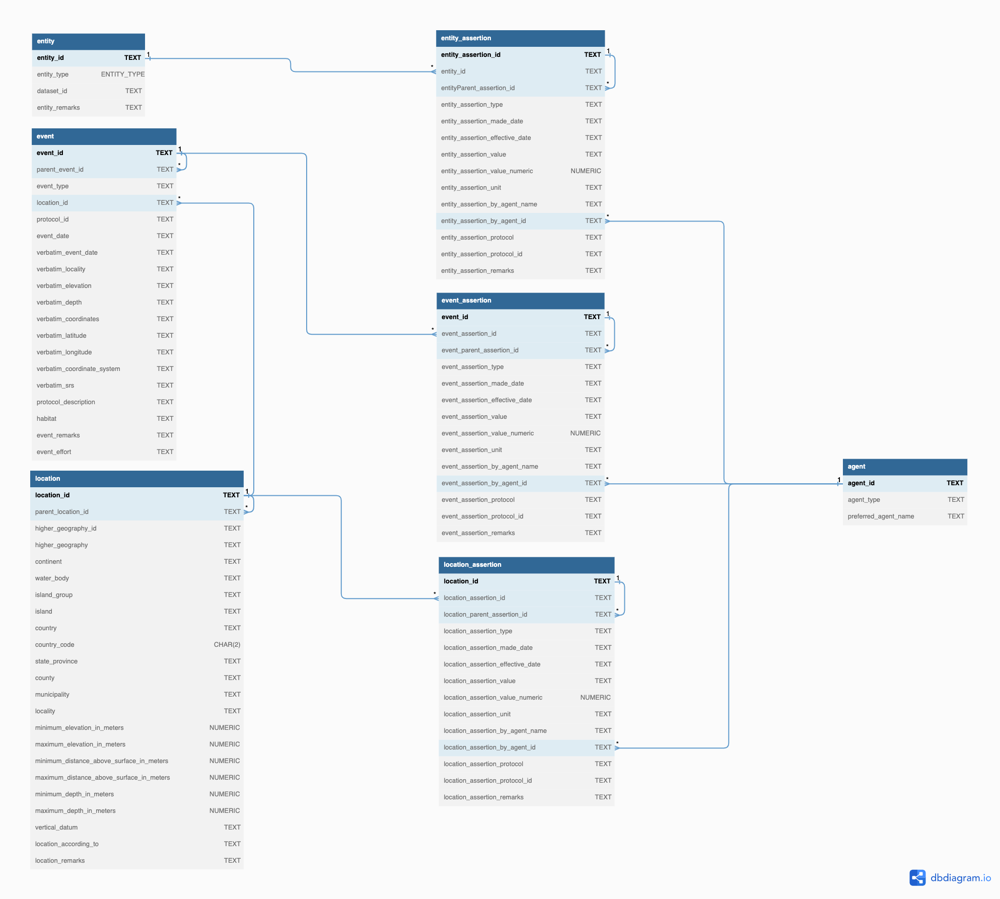

## 7. Add the `Identifiers`

The tables to populate are shown:

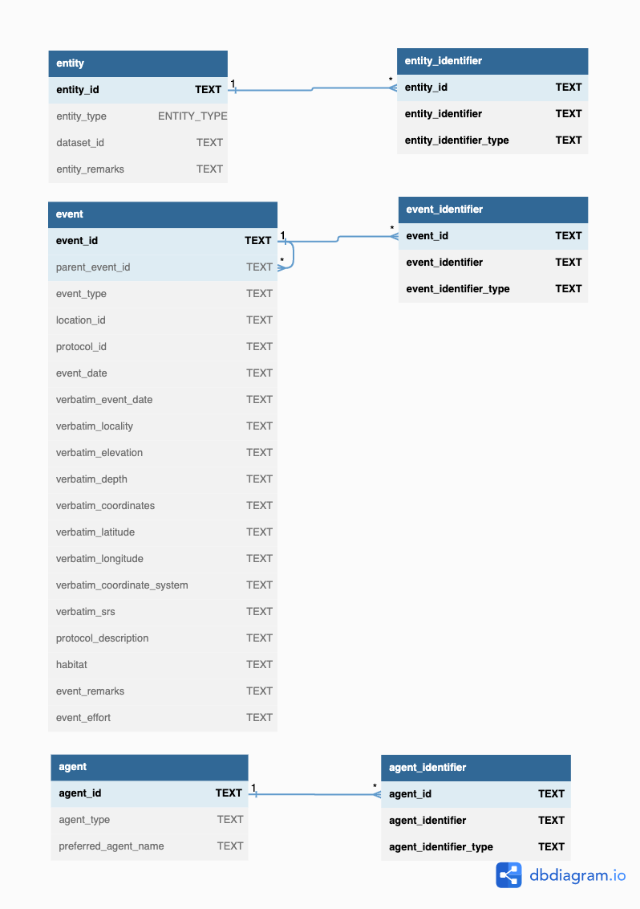
