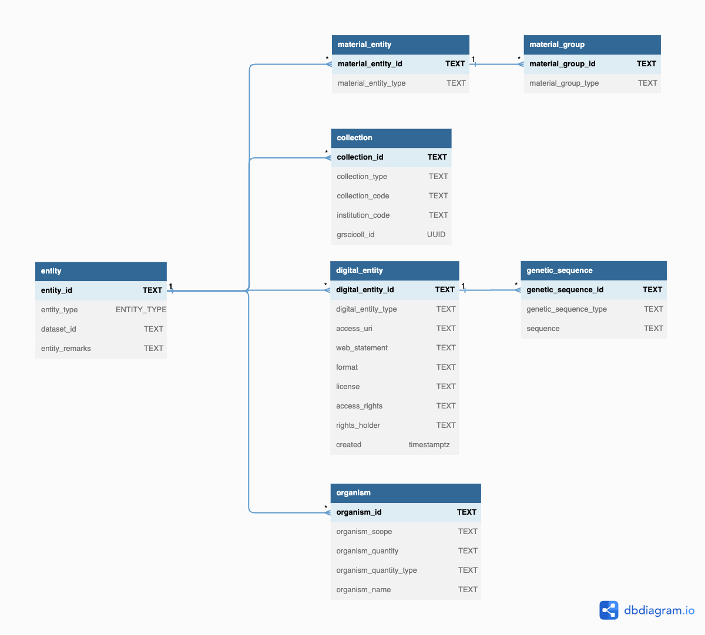

# Data mapping

The data model is highly normalized and it's understandable that it may feel overwhelming at first.
A suggested approach on how to map data to the model is provided, aiming to introduce it in sections.
These are structured as:

1. Create the core `Entities` in the model (i.e. Specimens, Images, Organisms)
2. Create the `EntityRelationships` between those `Entities` (e.g. capturing that a tissue sample was taken from a specimen)
3. Create the `Events` associated with the `Entities` (e.g. the gathering event)
4. Add the current and historical species `Identifications` to the `MaterialEntities` (Morphological or DNA based)
5. Connect the `Agents` (e.g. People) associated with the `Entities` and `Events`
6. Add the `Assertions` such as measurements or additional fields of interest for all `Entities`
7. Add the `Identifiers` to be tracked along with the `Entities`

It is likely that the source data being mapped won't have all data objects needed and some will need to be "invented". 
For example, a source database may have the collecting event and location merged into a single table. 
This will require an object to be split, or possibly inferred during the mapping.

- All primary keys in tables shown be globally unique, to allow the data to be mixed with data from other sources
- We recommend using a UUID as a key for any object inferred (for this exercise)
- Please always refer to the latest [data schema](./schema.sql) when mapping; it may have evolved since this documentation was created

## Create the core `Entities`

The tables to populate are shown:

Notes:

- This uses inheritance, and so an `Entity` record must exist with the *same ID* as the entry for the sub-entity (and so on)
- The `Entity` IDs should be globally unique as the records will be integrated with other 
- The `datasetKey` should be a globally unique identifier. In the absence of one, we recommended to use a UUID
